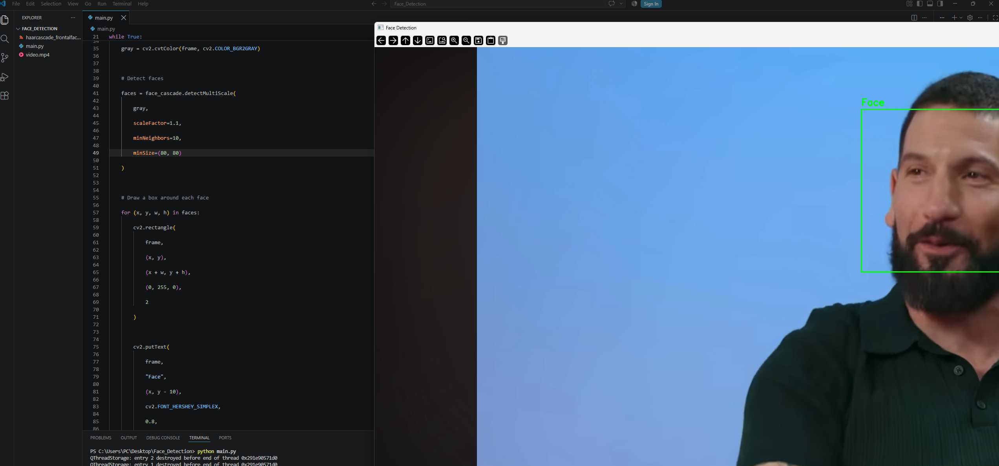

from pathlib import Path

content = """# Face Detection

## Overview

This project is a face detection application built using Python and the OpenCV library. It processes a video file and detects human faces in each video frame. When a face is detected, the system draws a bounding box around it and displays the label **"Face"**.

The project uses the Haar Cascade classifier provided by OpenCV for face detection.

## Features

- **Face Detection:** Detects human faces in video frames.
- **Bounding Box:** Draws a rectangle around each detected face.
- **Face Labeling:** Displays the label **"Face"** above the detected face.
- **Video Processing:** Processes a pre-recorded video instead of requiring a live camera.
- **Simple Usage:** The project is easy to run using Anaconda and Visual Studio Code.

## Technologies Used

- Python
- OpenCV
- Anaconda
- Visual Studio Code (VS Code)
- Haar Cascade Classifier

## Project Files

```text
Face_Detection/
│
├── main.py
├── video.mp4
├── haarcascade_frontalface_default.xml
└── README.md
```

## Environment Setup

Anaconda was used to create a separate Python environment for the project.

Create the environment using:

```bash
conda create -n face_recognition python=3.10
```

Activate the environment:

```bash
conda activate face_recognition
```

Install OpenCV:

```bash
pip install opencv-contrib-python
```

## Usage

1. Open the project folder in Visual Studio Code.
2. Make sure the Anaconda environment `face_recognition` is activated.
3. Place the video file inside the project folder.
4. Make sure `haarcascade_frontalface_default.xml` is also inside the project folder.
5. Open `main.py`.
6. Run the following command in the VS Code terminal:

```bash
python main.py
```

7. The program will process the video and detect human faces.
8. A bounding box will be drawn around each detected face and the label **"Face"** will be displayed.
9. Press **Q** to close the video window.

## How It Works

The project uses the Haar Cascade Classifier to detect faces.

The process is:

1. The program loads the Haar Cascade face detection model.
2. It opens the input video using OpenCV.
3. Each frame is converted to grayscale.
4. The face detector searches the frame for human faces.
5. When a face is detected, OpenCV draws a bounding box around it.
6. The label **"Face"** is displayed above the detected face.
7. The processed video is displayed in a separate window.

## Prediction Example

The screenshot below shows an example of the project output.

The system successfully detects a human face in the video and draws a bounding box around the detected face.

**Example:**



## Result

The project successfully demonstrates face detection from a pre-recorded video using OpenCV and the Haar Cascade Classifier.

## Author

**Wesal Ibrahim Alsharif**
CS Student at Taif University
"""

path = Path("/mnt/data/README.md")
path.write_text(content, encoding="utf-8")

print(f"Created: {path}")
